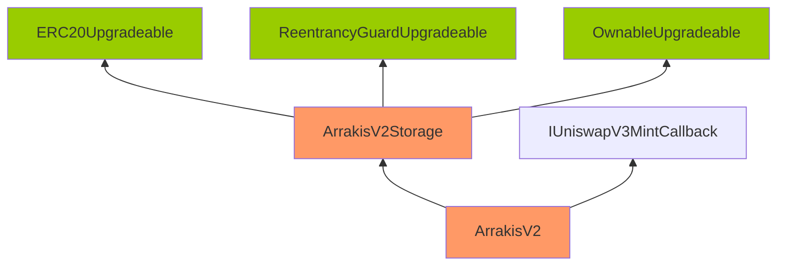
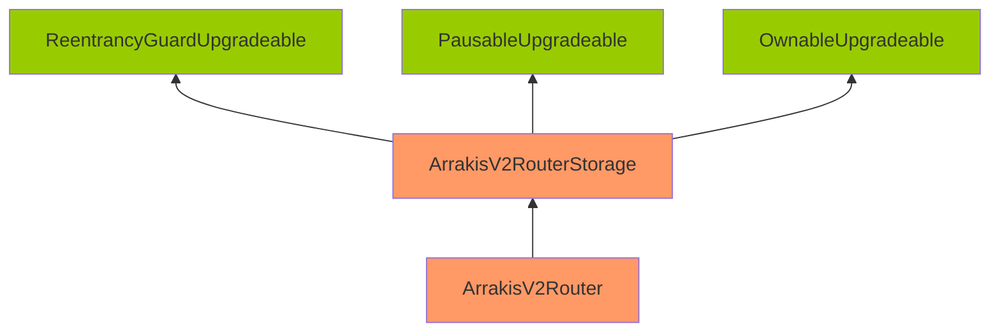
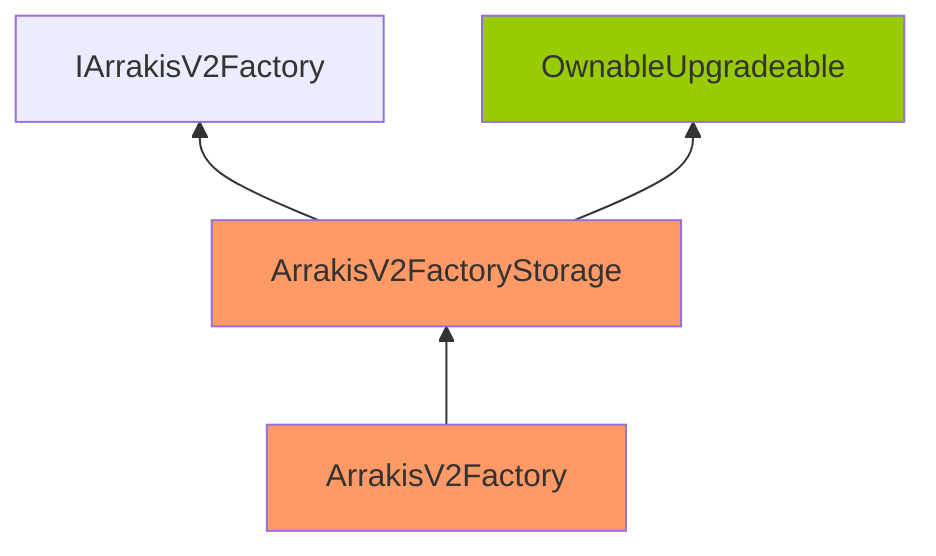

# Arrakis Sherlock Contest - Radev's Findings Report

# Findings Summary

| ID     | Title                                                              | Severity |
| ------ | ------------------------------------------------------------------ | -------- |
| [M-01] | `standardRebalance()` and `rebalance()` functions are extemely vulnerable to manipulation | Medium |
| [M-02] | Storage Corruption During an Upgrade | Medium |

---

# **Detailed Findings**

# [M-01] Missing Slippage protection

## Summary

`ArrakisV2Resolver#standardRebalance` and `SimpleManager#rebalance` rebalance ArrakisV2 vault's using the `UniV3Pool.slot0` price.
`slot0` price can be manipulated with flash loans.

## Vulnerability Detail

`slot0` is the most recent data point and is therefore extremely easy to manipulate.
The `slot0` price is calculated from the ratios of the assets. This ratio can however be manipulated by buying/selling assets in the pool.

https://docs.uniswap.org/contracts/v3/reference/core/interfaces/pool/IUniswapV3PoolState#slot0

## Impact

Price can be manipulated to cause flash loan exploits or loss of funds for the protocol and other users.

## Code Snippet

ArrakisV2Resolver#standardRebalance()
https://github.com/sherlock-audit/2023-06-arrakis/blob/main/v2-core/contracts/ArrakisV2Resolver.sol#L114-L120

SimpleManager#rebalance()
https://github.com/sherlock-audit/2023-06-arrakis/blob/main/v2-manager-templates/contracts/SimpleManager.sol#L181

## Tool used

Manual Review

## Recommendation

Use TWAP price instead of `slot0` price. Here is an example implementation of TWAP.


# [M-01] Storage Corruption During an Upgrade

## Summary
Lack of storage Gap in Upgradeable contracts

The `ArrakisV2`, `ArrakisV2Router`, and `ArrakisV2Factory` contracts could be at risk of storage corruption during an upgrade. This issue underlines the importance of meticulous attention when handling storage slots in the process of creating upgradeable contracts. Notably, when a contract is upgraded in the future, the specifications of the storage slots should remain consistent to ensure the integrity of the contract's data and functionality.


## Vulnerability Detail
Following are the inheritance of the `ArrakisV2`, `ArrakisV2Router` and `ArrakisV2Factory` contracts.

**Note:** The contracts highlighted in `Orange are the contracts when there are no gap slots defined`. The contracts highlighted in `Green are the openzeppelin upgradeable that gap slots have been defined`.

**Inheritance of the ArrakisV2 contract**




**Inheritance of the ArrakisV2Router contract**




**Inheritance of the ArrakisV2Factory contract**



A similar vulnerability exists in the SimpleManager contract.


## Impact
This issue poses a critical risk to the protocol's proper functioning, as storage slots may become mixed up, further exacerbating the disruption. The impact of the vulnerability could significantly undermine the contract system's stability and reliability.

The ArrakisV2, ArrakisV2Router and ArrakisV2Factory contracts are meant to be upgradeable. However, it inherits contracts that are not upgrade-safe.

The storage gap is implemented on the ERC20Upgradeable, ReentrancyGuardUpgradeable, OwnableUpgradeable and PausableUpgradeable imported contracts from https://github.com/OpenZeppelin/openzeppelin-contracts-upgradeable.

However, no gap storage is implemented on the:
 - ArrakisV2Storage contract inherited by the ArrakisV2 contract
 - ArrakisV2RouterStorage contract inherited by the ArrakisV2Router contract
 - ArrakisV2FactoryStorage contract inherited by the ArrakisV2Factory contract

Thus, adding new storage variables to any of these inherited contracts can potentially overwrite the beginning of the storage layout of the child contract. causing critical misbehaviors in the system.

## Code Snippet
https://github.com/sherlock-audit/2023-06-arrakis/blob/main/v2-core/contracts/ArrakisV2.sol#L32

https://github.com/sherlock-audit/2023-06-arrakis/blob/main/v2-periphery/contracts/ArrakisV2Router.sol#L33

https://github.com/sherlock-audit/2023-06-arrakis/blob/main/v2-core/contracts/ArrakisV2Factory.sol#L23


## Tool used
Manual Review


## Recommendation
To prevent collisions with existing storage slots during future upgrades, it's recommended to define an appropriate storage gap in each upgradeable parent contract. This gap should be positioned at the end of all storage variable definitions. Moreover, consider adding a uint array with private visibility to enhance security and integrity of the data. A practical example of this approach, outlined in Solidity, is as follows:

```solidity
uint256[50] __gap; // gap to reserve storage in the contract for future variable additions
```

This implementation is in line with best practices for developing upgradeable contracts, as detailed in OpenZeppelin's [guide on writing upgradeable contracts](https://docs.openzeppelin.com/upgrades-plugins/1.x/writing-upgradeable#use-upgradeable-libraries). The proposed solution allows a clear segregation of storage space, reducing the risk of overwriting existing data and ensuring smooth contract upgrades.

#### Note
The same vulnerability also exists in the ArrakisV2StaticManager and ArrakisV2GaugeFactory contracts, which are out of the scope for this audit contest.